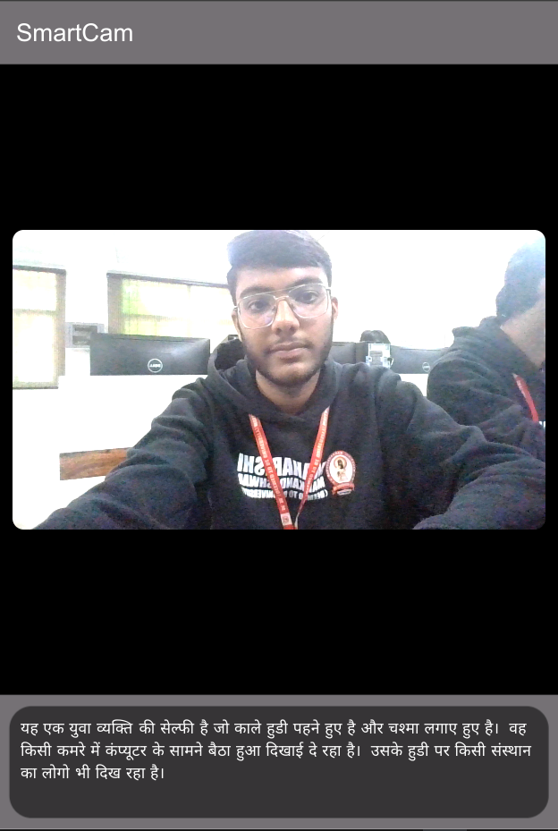

# SmartCam

## What are we going to build?
We are going to build a sample page of an app in flutter, which captures the image from camera, and then displays the description of the image, and also speaks it through description. The description is fetched through Gemini API.



## Prerequisites
- A system with minimum 8 gb of ram
- Flutter installed and configured on the system
- Flutter extension installed in VS Code

## Creating new project

Visual Studio Code and other IDE's provide us with ways to automatically create new flutter project with boiler plate code already written, along with all the build files.

In VS Code, press Ctrl+Shift+P and type 'Flutter'. You would see `Flutter: New Project`option. Click on the option, and you would be asked to select the folder you want to create project in. After selecting the folder, select 'New Application'. Enter the name of the project, and the project structure would be created.

## Understanding directory structure
Flutter follows a defined directory structure for the projects.

Here are the most important sub-directories:

### android, ios, linux, macos, web, windows
These hold platform-specific build files to run the project on these platforms

### lib
The cross-platform code we write for the app

### pubspec.yaml
Holds the package information

## Removing the unncessary boilerplate
By default, Flutter provides a counter app. First, remove the `MyHomePage` from `main.dart` and unncessary comments. You can also remove the color theme if you want.

## Installing the required packages
We are going to require these packages for various functionalities:

### camera
Provides access to cameras on multiple platforms

### flutter_tts
Provides Google's Text To Speech Services on various platforms

### flutter_gemini
Provides access to Gemini inside a Flutter app

You can install these packages by running these commands in the terminal:

```bash
flutter pub add camera flutter_tts flutter_gemini
```

## Creating the SmartCam screen
Create a new file in `lib` directory. Give it a suitable name, say `smart_cam.dart`.

We need to import Flutter's `material` library to use widgets. We also need `flutter_gemini` and `flutter_tts`for the respective functionalities.

```dart
import 'package:flutter/material.dart';
import 'package:flutter_gemini/flutter_gemini.dart';
import 'package:flutter_tts/flutter_tts.dart';
```

Then we will be creating a page or screen. To do so, write `stf` in VS Code window, and it will automatically give you suggestion to create a `Stateful Widget`.  Give it a suitable name, say `SmartCam`.

Inside the `SmartCam` class, create a variable `language` to store the language and create a constructor also:

```dart
final String language;
SmartCam(this.language);
```

## Building the UI
We need to override the `build` method in the state of the widget to specify the apperance of the widget.

For now, write this code:

```dart
@override
  Widget build(BuildContext context) {
    return Scaffold(
        appBar: AppBar(
          title: Text("SmartCam"),
          backgroundColor: Colors.black54,
          foregroundColor: Colors.white,
        ),
        body: Center(
          child: GestureDetector(
            onLongPress: () {
            },
            child: Column(
                crossAxisAlignment: CrossAxisAlignment.center,
                children: [
                  Expanded(
                    child: Container(
                      color: Colors.black,
                      child: Container(
                          height:
                              2 * (MediaQuery.sizeOf(context).height / 3) - 60,
                          decoration: BoxDecoration(
                              border:
                                  Border.all(color: Colors.black, width: 13)),
                          child: Center(
                              child: ClipRRect(
                                  borderRadius: BorderRadius.circular(10),
                                  child: Placeholder()))),
                    ),
                  ),
                  Align(
                      alignment: Alignment.center,
                      child: Container(
                          width: MediaQuery.sizeOf(context).width,
                          color: Colors.black54,
                          child: Container(
                              padding: EdgeInsets.all(10),
                              margin: EdgeInsets.all(10),
                              decoration: BoxDecoration(
                                color: Colors.black54,
                                borderRadius: BorderRadius.circular(20),
                              ),
                              child: Text(
                                'Hello',
                                style: TextStyle(color: Colors.white),
                              ))))
                ]),
          ),
        ));
  }
```

To show this UI, inside `main.dart` file, use this `SmartCam('english')` as `home: ` argument.

Now, we have got the sample UI without the functionality.

If you are running it in DartPad, the following code will work:
```dart
import 'package:flutter/material.dart';

void main() {
  WidgetsFlutterBinding.ensureInitialized();
  runApp(const MyApp());
}

class MyApp extends StatelessWidget {
  const MyApp({super.key});

  @override
  Widget build(BuildContext context) {
    return MaterialApp(
      debugShowCheckedModeBanner: false,
      title: 'Flutter Demo',
      home: SmartCam('hindi'),
    );
  }
}

class SmartCam extends StatefulWidget {
  final String language;
  SmartCam(this.language);

  @override
  State<SmartCam> createState() => _SmartCamState();
}

class _SmartCamState extends State<SmartCam> {
  @override
  Widget build(BuildContext context) {
    return Scaffold(
        appBar: AppBar(
          title: Text("SmartCam"),
          backgroundColor: Colors.black54,
          foregroundColor: Colors.white,
        ),
        body: Center(
          child: GestureDetector(
            onLongPress: () {},
            child: Column(
                crossAxisAlignment: CrossAxisAlignment.center,
                children: [
                  Expanded(
                    child: Container(
                      color: Colors.black,
                      child: Container(
                          height:
                              2 * (MediaQuery.sizeOf(context).height / 3) - 60,
                          decoration: BoxDecoration(
                              border:
                                  Border.all(color: Colors.black, width: 13)),
                          child: Center(
                              child: ClipRRect(
                                  borderRadius: BorderRadius.circular(10),
                                  child: Placeholder()))),
                    ),
                  ),
                  Align(
                      alignment: Alignment.center,
                      child: Container(
                          width: MediaQuery.sizeOf(context).width,
                          color: Colors.black54,
                          child: Container(
                              padding: EdgeInsets.all(10),
                              margin: EdgeInsets.all(10),
                              decoration: BoxDecoration(
                                color: Colors.black54,
                                borderRadius: BorderRadius.circular(20),
                              ),
                              child: Text(
                                'Hello',
                                style: TextStyle(color: Colors.white),
                              ))))
                ]),
          ),
        ));
  }
}

```

From this onwards, all of the code needs to be run on system, and can not run on DartPad.

## Initialising the camera
`camera` package provides the camera functionality. According to the documentation, we will create two variables in the state:
- `late List<CameraDescription> _cameras;`- Holds the list of cameras available on the system. It would be initialised late when the state is initialised.
- `CameraController? controller;`- Holds the `CameraController` for the current camera. It provides the methods to read camera feed. It can be null because certain systems may not have any camera.

Now, we will create an `void initState()` method according to the documentation:

```dart
@override
  void initState() {
    super.initState();
    availableCameras().then((value) {
      _cameras = value;
      controller = CameraController(_cameras[0], ResolutionPreset.max);
      controller?.initialize().then((_) {
        if (!mounted) {
          return;
        }
        setState(() {});
      }).catchError((Object e) {
      });
    });
  }
```

## Displaying the camera feed
Now, we would first understand some other variables required in the state. 

Put these variables in the state:
```
bool processing = false;
Uint8List? image;
String description = '';
```

- `processing` - It indicates whether the image captured has finished processing
- `image` - It stores the captured image.
- `description` - It holds the textual description of image showed in UI in the bottom.

Now, we need to display the camera feed into the UI we created. We had put a placeholder for showing the camera feed. We will replace that with a 
`Stack` widget because Stack can hold multiple widgets in it.

Create a method `_showImage` which will return the widgets in stack:

```bash
List<Widget> _showImage(CameraController? controller, Uint8List? image) {
    if (controller == null) {
      return <Widget>[
        SizedBox(
          width: 1,
        )
      ];
    } else if (processing == false) {
      return <Widget>[
        CameraPreview(controller),
      ];
    } else if (processing == true) {
      return <Widget>[
        Image.memory(image!),
        Positioned.fill(
            child: Center(child: CircularProgressIndicator.adaptive()))
      ];
    } else {
      return <Widget>[
        CameraPreview(controller),
      ];
    }
  }
```

- If the camera is not initialised, i.e. `controller` is null, then show nothing. For it, we have placed a `SizedBox` with nothing in it.
- If the image is processing, show that static image on screen and do not show the camera feed. Since, `image` variables stores the captured image in memory, we use `Image.network` to display that image. `Positioned.fill` along with `Center` widget with `CircularProgressIndicator`, displays a loading circular indicator above captured image.
- If the there is no image being processed, show the camera feed and not static image via use of `CameraPreview`.

Inside the `build` method of state, use `description` inside `Text` widget, like:

```dart
Text(description,
    style: TextStyle(color: Colors.white
)
```

## Integrating Gemini

To integrate Gemini, we first need to import and initialise Gemini package (which we already installed) in the `main.dart` file. Put this code inside `main.dart` inside the `void main()` function, before the `runApp(const MyApp());` statement.

```
WidgetsFlutterBinding.ensureInitialized();
Gemini.init(apiKey: 'your key here');
```

You need to get this key from [https://aistudio.google.com/app/apikey](https://aistudio.google.com/app/apikey).

Now, in `smart_cam.dart file`, create a variable inside state:

```dart
final gemini = Gemini.instance;
```

Now, create a method:

```dart
void _describeImage() async {
    var picture = await controller?.takePicture();
    var b = await picture?.readAsBytes();
    setState(() {
      processing = true;
      image = b;
    });
    var response = await gemini.textAndImage(
        text:
            "What does this show? Respond in ${widget.language} language with 3-4 lines",
        images: [b!]);
    var p = response?.outputPart as TextPart;
    setState(() {
      description = p.text;
      processing = false;
    });
}
```

This method captures the picture from `CameraController`, reads it as bytes, and then sets `processing` to true, and sets the captured image. This ensures UI is built again to reflect that image is captured and is being processed, i.e. a static captured image would be shown, along with circular progress indicator above it.

Then, it sends the image to Gemini along with the prompt, and receives the text from it, and then sets `description` to the text received from Gemini and sets `processing` to false again. This ensures description is now shown in the UI and the static image is again replaced by camera feed.

## Integrating TextToSpeech

In `smart_cam.dart` file, import the package for TextToSpeech:

```dart
import 'package:flutter_tts/flutter_tts.dart';
```

In the `SmartCamState`, create a variable:

```dart
final tts = FlutterTts();
```

Inside `initState` method, add the following:

```dart
if (widget.language.toLowerCase() == 'hindi') {
      tts.setLanguage('hi');
}
```
It ensures that if language is Hindi, correct language is chosen for TextToSpeech.

In the `_describeImage` method, add the following at the end:

```dart
tts.speak(p.text);
```

This ensures the text which is received from Gemini is spoken by TextToSpeech.

## Conclusion
So, we just built a simple flutter project including the vision capabilities of Gemini with camera.

The full code at the end looks like this:

main.dart
```dart
import 'package:flutter/material.dart';
import 'package:flutter_gemini/flutter_gemini.dart';
import './smart_cam.dart';

void main() {
  WidgetsFlutterBinding.ensureInitialized();
  Gemini.init(apiKey: 'your key here');
  runApp(const MyApp());
}

class MyApp extends StatelessWidget {
  const MyApp({super.key});

  @override
  Widget build(BuildContext context) {
    return MaterialApp(
      debugShowCheckedModeBanner: false,
      title: 'Flutter Demo',
      home: SmartCam('hindi'),
    );
  }
}

```

smart_cam.dart
```dart
import 'dart:typed_data';
import 'package:camera/camera.dart';
import 'package:flutter/material.dart';
import 'package:flutter_gemini/flutter_gemini.dart';
import 'package:flutter_tts/flutter_tts.dart';

class SmartCam extends StatefulWidget {
  final String language;
  SmartCam(this.language);

  @override
  State<SmartCam> createState() => _SmartCamState();
}

class _SmartCamState extends State<SmartCam> {
  late List<CameraDescription> _cameras;
  CameraController? controller;

  bool processing = false;
  Uint8List? image;
  String description = '';

  final gemini = Gemini.instance;
  
  final tts = FlutterTts();

  @override
  void initState() {
    super.initState();
    if (widget.language.toLowerCase() == 'hindi') {
      tts.setLanguage('hi');
    }
    availableCameras().then((value) {
      _cameras = value;
      controller = CameraController(_cameras[0], ResolutionPreset.max);
      controller?.initialize().then((_) {
        if (!mounted) {
          return;
        }
        setState(() {});
      }).catchError((Object e) {
      });
    });
  }

  List<Widget> _showImage(CameraController? controller, Uint8List? image) {
    if (controller == null) {
      return <Widget>[
        SizedBox(
          width: 1,
        )
      ];
    } else if (processing == false) {
      return <Widget>[
        CameraPreview(controller),
      ];
    } else if (processing == true) {
      return <Widget>[
        Image.memory(image!),
        Positioned.fill(
            child: Center(child: CircularProgressIndicator.adaptive()))
      ];
    } else {
      return <Widget>[
        CameraPreview(controller),
      ];
    }
  }

  void _describeImage() async {
    var picture = await controller?.takePicture();
    var b = await picture?.readAsBytes();
    setState(() {
      processing = true;
      image = b;
    });
    var response = await gemini.textAndImage(
        text:
            "What does this show? Respond in ${widget.language} language with 3-4 lines",
        images: [b!]);
    var p = response?.outputPart as TextPart;
    setState(() {
      description = p.text;
      processing = false;
    });
    tts.speak(p.text);
  }

  @override
  void dispose() {
    controller?.dispose();
    super.dispose();
  }

  @override
  Widget build(BuildContext context) {
    return Scaffold(
        appBar: AppBar(
          title: Text("SmartCam"),
          backgroundColor: Colors.black54,
          foregroundColor: Colors.white,
        ),
        body: Center(
          child: GestureDetector(
            onLongPress: () {
              _describeImage();
            },
            child: Column(
                crossAxisAlignment: CrossAxisAlignment.center,
                children: [
                  Expanded(
                    child: Container(
                      color: Colors.black,
                      child: Container(
                          height:
                              2 * (MediaQuery.sizeOf(context).height / 3) - 60,
                          decoration: BoxDecoration(
                              border:
                                  Border.all(color: Colors.black, width: 13)),
                          child: Center(
                              child: ClipRRect(
                                  borderRadius: BorderRadius.circular(10),
                                  child: Stack(
                                      children:
                                          _showImage(controller, image))))),
                    ),
                  ),
                  Align(
                      alignment: Alignment.center,
                      child: Container(
                          width: MediaQuery.sizeOf(context).width,
                          color: Colors.black54,
                          child: Container(
                              padding: EdgeInsets.all(10),
                              margin: EdgeInsets.all(10),
                              decoration: BoxDecoration(
                                color: Colors.black54,
                                borderRadius: BorderRadius.circular(20),
                              ),
                              child: Text(
                                description,
                                style: TextStyle(color: Colors.white),
                              ))))
                ]),
          ),
        ));
  }
}

```

The code of this sits at GitHub repository: [https://github.com/imhemish/smart_cam](https://github.com/imhemish/smart_cam).
